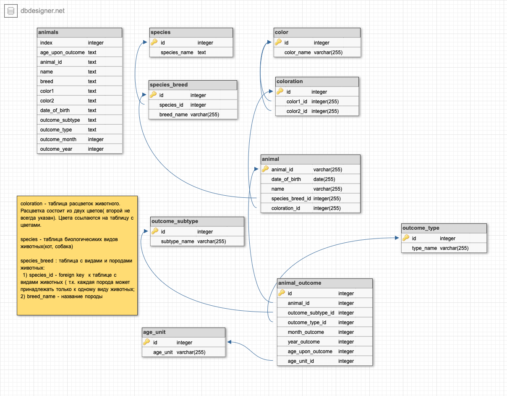

# Домашнее задание Homework 15.2.
## Нормализация базы данных.

 На схема ниже представлена схема исходной базы данных и архитектура после нормализации.

Приложение показывает информацию о записи базы данных по ее номеру в системе (/item_id) 

Файлы queries.py и queries.sql - использовались при создании и переносе данных.